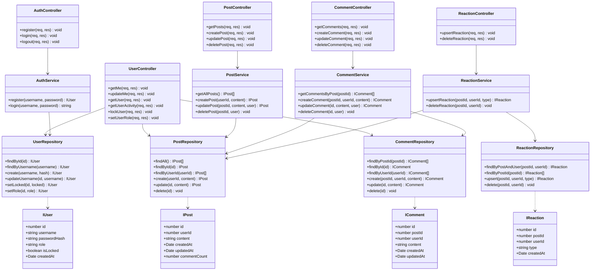

# Architecture

Class diagram of the backend — controllers, services, repositories, interfaces, and error hierarchy.

```mermaid
classDiagram
    direction TB

    %% ── Interfaces ──────────────────────────────────────────
    class IUser {
        +number id
        +string username
        +string passwordHash
        +string role
        +boolean isLocked
        +Date createdAt
    }

    class IPost {
        +number id
        +number userId
        +string content
        +Date createdAt
        +Date updatedAt
        +number commentCount
    }

    class IComment {
        +number id
        +number postId
        +number userId
        +string content
        +Date createdAt
        +Date updatedAt
    }

    class IReaction {
        +number id
        +number postId
        +number userId
        +string type
        +Date createdAt
    }

    %% ── Repositories ─────────────────────────────────────────
    class UserRepository {
        +findById(id) IUser
        +findByUsername(username) IUser
        +create(username, hash) IUser
        +updateUsername(id, username) IUser
        +setLocked(id, locked) IUser
        +setRole(id, role) IUser
    }

    class PostRepository {
        +findAll() IPost[]
        +findById(id) IPost
        +findByUserId(userId) IPost[]
        +create(userId, content) IPost
        +update(id, content) IPost
        +delete(id) void
    }

    class CommentRepository {
        +findByPostId(postId) IComment[]
        +findById(id) IComment
        +findByUserId(userId) IComment[]
        +create(postId, userId, content) IComment
        +update(id, content) IComment
        +delete(id) void
    }

    class ReactionRepository {
        +findByPostAndUser(postId, userId) IReaction
        +findByPostId(postId) IReaction[]
        +upsert(postId, userId, type) IReaction
        +delete(postId, userId) void
    }

    %% ── Services ─────────────────────────────────────────────
    class AuthService {
        +register(username, password) IUser
        +login(username, password) string
    }

    class PostService {
        +getAllPosts() IPost[]
        +createPost(userId, content) IPost
        +updatePost(postId, content, user) IPost
        +deletePost(postId, user) void
    }

    class CommentService {
        +getCommentsByPost(postId) IComment[]
        +createComment(postId, userId, content) IComment
        +updateComment(id, content, user) IComment
        +deleteComment(id, user) void
    }

    class ReactionService {
        +upsertReaction(postId, userId, type) IReaction
        +deleteReaction(postId, userId) void
    }

    %% ── Controllers ──────────────────────────────────────────
    class AuthController {
        +register(req, res) void
        +login(req, res) void
        +logout(req, res) void
    }

    class PostController {
        +getPosts(req, res) void
        +createPost(req, res) void
        +updatePost(req, res) void
        +deletePost(req, res) void
    }

    class CommentController {
        +getComments(req, res) void
        +createComment(req, res) void
        +updateComment(req, res) void
        +deleteComment(req, res) void
    }

    class ReactionController {
        +upsertReaction(req, res) void
        +deleteReaction(req, res) void
    }

    class UserController {
        +getMe(req, res) void
        +updateMe(req, res) void
        +getUser(req, res) void
        +getUserActivity(req, res) void
        +lockUser(req, res) void
        +setUserRole(req, res) void
    }

    %% ── Dependencies ─────────────────────────────────────────
    AuthController --> AuthService
    PostController --> PostService
    CommentController --> CommentService
    ReactionController --> ReactionService
    UserController --> UserRepository
    UserController --> PostRepository
    UserController --> CommentRepository

    AuthService --> UserRepository
    PostService --> PostRepository
    CommentService --> CommentRepository
    CommentService --> PostRepository
    ReactionService --> ReactionRepository
    ReactionService --> PostRepository

    UserRepository ..> IUser
    PostRepository ..> IPost
    CommentRepository ..> IComment
    ReactionRepository ..> IReaction
```
